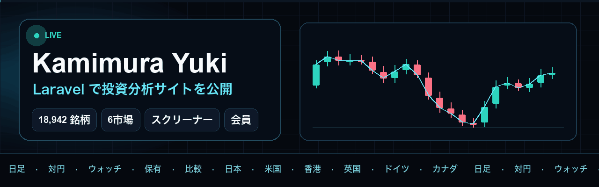
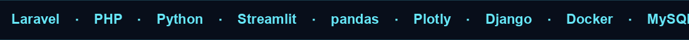
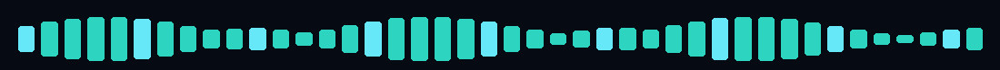
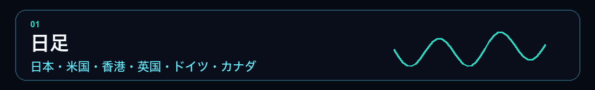
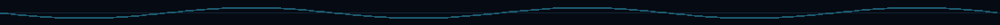

 

  

Kamimura Yuki です。
日本株から海外株、為替まで、日足とテクニカルを一つの画面で見比べられるようにしています。公開しているサイトは Laravel、分析用の画面は Python で作っています。

## 公開中のサイト

**[trade-information](https://trade-information.laravel.cloud/Meigara)** は、2026年にリリースした投資分析サイトです。スクリーナーは誰でも使え、銘柄の詳細、FX、取引ルール、ウォッチリスト、保有記録、銘柄比較は会員向けです。無料データの株価は遅延します。

| | |
| --- | --- |
| スクリーナー | 18,942銘柄。コードと企業名で検索し、アジア / アメリカ / 欧州で絞り込み。一覧からチャートへ進める |
| 日足 | 日本、米国、香港、英国、ドイツ、カナダ |
| FX | 対円レート（会員向け） |
| テクニカル | オシレーターと移動平均（会員向けの銘柄詳細） |
| 会員向け | ウォッチリスト、保有記録、銘柄比較、分析50。詳細、FX、取引ルールも含む |
| 入り方 | パスワードは使わず、メールのログインリンク、パスキー、Google |
| データ | J-Quants、Alpha Vantage、Open Exchange Rates、Google |

| 地域 | 市場 |
| --- | --- |
| アジア | 日本株、香港株 |
| アメリカ | 米国株、カナダ株 |
| 欧州 | 英国株、ドイツ株 |

## 分析用に作った画面

**[FX 為替マーケットダッシュボード](https://github.com/key-pro/streamlit)** は、Streamlit で作った手元用の分析画面です。`yfinance` から為替を取り、26通貨ペアをタイルで並べます。各タイルには価格、変動率、スパークラインがあり、そこから詳細へ進めます。米国株版は `main_us_stocks.py` から起動します。データには約15〜20分の遅れがあります。

| 分類 | 見られるもの |
| --- | --- |
| トレンド | SMA(20/50)、EMA(20)、ボリンジャーバンド、一目均衡表、DMI/ADX、パラボリックSAR、エンベロープ |
| オシレーター | RSI(14)、MACD、ストキャスティクス、サイコロジカルライン、RCI、移動平均乖離率、ヒストリカル・ボラティリティ |
| そのほか | ローソク足、フィボナッチ、ダブルボトム / ダブルトップや三尊の目視用表示、ダークとライトの切替 |

通貨ペアは、メジャー、クロス円、ユーロクロス、その他の4グループです。画面は `utils` でデータ取得と指標計算、`components` でチャートとゲージに分けています。

## 手元で使うツール

**[PDF統合ソフト](https://github.com/key-pro/PDF_Integration_App)**  
Tkinter の画面に PDF をドロップすると、ファイル名の数字順に並べて1つに結合します。PyInstaller で exe にできます。

**[Django + Docker](https://github.com/key-pro/Django_docker)**  
株価の取得と、scikit-learn による回帰を Django REST framework に載せた構成です。MySQL、Gunicorn、Docker Compose で動かします。

## 技術の使い分け

| 用途 | 技術 |
| --- | --- |
| 公開サイト | Laravel、PHP。会員ログインはメールリンク、パスキー、Google |
| 分析画面 | Python、Streamlit、pandas、Plotly、yfinance |
| API と実行環境 | Django REST framework、Docker、MySQL |
| 画面の基礎 | React、TypeScript、styled-components、Java |

## これまで

| 時期 | 内容 |
| --- | --- |
| 2022 | Django でブログ（[firstProject](https://github.com/key-pro/firstProject)）と、アカウント・カテゴリ付きの写真投稿（[photoProject](https://github.com/key-pro/photoProject)）。[React + TypeScript](https://github.com/key-pro/react-typescript-app) の画面演習。Java で[電卓](https://github.com/key-pro/java-calculator)、[デスクトップアプリ](https://github.com/key-pro/java_application)、[Web システム](https://github.com/key-pro/java_websystem)。[Video.js](https://github.com/key-pro/Video.js-Yes-improvement) の改善前後を並べた比較 |
| 2024 | Todo、メモ、電卓、ゲームを PHP / Python / JavaScript / C# で書き分け（[Training_data_2024](https://github.com/key-pro/Training_data_2024)）。株価アプリを Django と Docker に載せる |
| 2025 | PDF を結合するデスクトップアプリ。FX と米国株の Streamlit ダッシュボード |
| 2026 | [trade-information](https://trade-information.laravel.cloud/Meigara) を Laravel でリリース。6市場の日足スクリーナーに加え、会員はウォッチ、保有、比較、対円レート、テクニカル |

